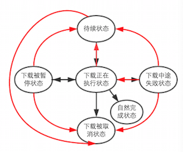

#	续言关于下载管理的探讨

*	继上次发博，叙述实现项目下载管理时遇到的种种问题，以及应对之策后，不少大神纷纷指出，笔者的用法可能不太对，没有细读源码等等。可遗憾的是，批评过后，却始终无人提出一套完整有效的解决方案来处理下载管理的需求。实际上这个才是重点中的重点啊！可惜抛砖引玉未能成功😂。笔者现把个人认为理想的下载任务管理的模型整理如下，期待能有大神给予完美的实现，供更多开发者学习交流。

---
*	首先，理想的解决方案，应当使每个下载任务各自作为一个实体对象，而这样的一个对象起码应当至少有如下几个最最基本的属性：

	1.	下载任务的标示id
	2.	下载的进度（只读）
	3.	下载任务的状态（只读） 👀
	4.	下载资源的URL地址
	5.	下载到本地的保存地址
	6.	下载任务的创立时间
	7.	下载任务的完成时间
	8.	......  
(其中下载任务的状态，应当至少分为六种：待续状态、正在执行状态、暂停状态、中途失败状态、自然完成状态、被取消状态)
*	其次，这个下载任务对象还应该有相应的方法或途径，实现如图所示的六种状态间的转换
  
`（其中红色箭头表示笔者认为倘使用AFHTTPRequestOperation是没有直接途径或不易做到的转换）`  

理由即为需求，其中最棘手的一点常是： 
	
	往往会有规定，队列最多允许有多少个任务同时处于正在下载的状态中。因此我们在将某个暂停或中途失败的任务恢复时，就不能认为只需将其恢复至正在执行中的状态就OK了，而应当根据队列中正在执行的下载任务的数量，决定是将其恢复至正在执行的状态，还是等待就绪的状态
	
总结上图，下载任务在处于不同的状态时，应当分别能够做到如下所列的几种行为

	1.	处于待续状态时，可手动启动该任务，或直接将该任务取消，移出下载队列
	2.	处于正在执行状态时，可使该任务暂停，或恢复至待续状态，或直接将该任务取消，移出下载队列，或由其自身转变为自然完成/下载中途失败的状态
	3.	处于暂停状态时，可使之恢复至待续状态/正在执行状态，或直接将该任务取消，移出下载队列
	4.	处于下载中途失败的状态时，可使之恢复至待续状态/正在执行状态，或直接将该任务取消，移出下载队列（基本要跟处于暂停状态时能够做到的事情一样）
	5.	处于被取消状态或自然完成后的状态时，可以不需要有向其它状态转换的方式

*	这个对象还应当有在下载被启动时（不仅手动启动，还可能是在队列中轮到了该任务），下载进度发生变化时，下载自然完成时，下载中途失败时的自动调用回调方法；或能够做到对下载进度、下载任务状态变化的KVO亦可

*	这个对象应当能够便利于下载任务的启动及恢复重建

*	这个对象还应有方便于本地持久化储存的能力，如可以实现NSCoding协议之类

*	......其它能够使得下载任务变得更加高效的特性

---
*	其次是下载队列，应当具备如下特性：

	1.	通常的需求，存在于下载队列中归其管理的任务，应当是处于这四种状态的：待续状态、正在执行状态、暂停状态、中途失败状态；而处于自然完成状态、被取消状态的任务，应当不被包含在下载队列当中
	2.	这个队列当中，除当任务自然完成，或被人为取消时，要将该任务移除队列以外，不能因为其中任何任务的任何状态的变化而改变它们之间的相互顺序
	3.	这个队列要能够控制同时处于正在执行状态的下载任务的最大个数，这就意味着当队列中的某一个任务从正在执行状态变为其它非待续状态的状态之后，就要检测队列中还有无处于待续状态的任务，并启动之，以补充同时正在执行的下载任务的数量
	4.	下载队列的顺序应当能够通过某种方式进行本地的持久化存储
	5.	......其它能够使得下载管理变得更加高效的特性
	
---
*	以上是笔者认为最合理的下载管理解决方案应具备的特性。笔者承认自己才疏学浅，当前项目所使用方案确有甚多不尽完美之处，不值得向广大开源社区进行推广。现仅想以这两篇浅陋博文为砖，引来大神诠释完美技术手段，以实现上述理想中的需求。笔者愿洗耳恭听，以解心中疑惑，感念之情溢于言表